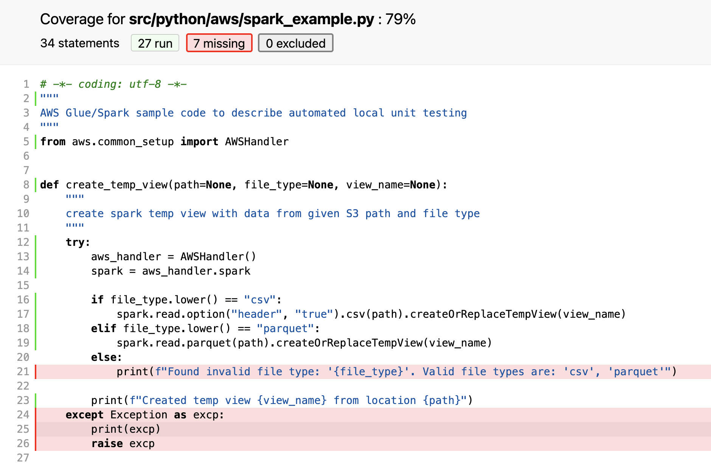

# AWS Glue and Apache Spark Unit Testing Using LocalStack

Unit testing in software development is a testing approach in which the smallest parts of an application, called units, are individually and independently tested to see if they are built to achieve expected outcome.  Unit testing can be done manually but is usually automated to enhance efficiency by reducing time of testing while in development phase.  It also helps identify potential issues when the code is changed to accommodate more features or fixes.

This codebase covers a use-case that describes how to setup local AWS Glue and Apache Spark environment to perform automated unit testing using [localstack](https://github.com/localstack/localstack). The code and tests here are intended as examples and helps getting started on the local setup. The setup script helps setup the required environment that can be used as a base to write codebase and tests required for specific application requirements.

# Localstack

LocalStack provides an easy-to-use test/mocking framework for developing Cloud applications. It spins up a testing environment on your local machine that provides the same functionality and APIs as the real AWS cloud environment. LocalStack comes in two flavors - as a free, open-source Community Edition, and as a Pro Edition with extended features and support. Please refer to the Reference section below for more details. Currently the Community Edition supports below AWS Services.

|ACM|Elasticsearch Service|Route53|
----|---------------------|-------|
|API|Gateway|EventBridge(CloudWatch Events)|S3|
|CloudFormation|Firehose|SecretsManager|
|CloudWatch|IAM|SES|
|CloudWatch|Logs|Kinesis|SNS|
|DynamoDB|KMS|SQS|
|DynamoDB|Streams|Lambda|SSM|
|EC2|Redshift|StepFunctions|

Clicking on the CLI option opens a new terminal window and session where AWS CLI commands can be executed. Below section describes some examples to access AWS services using AWS CLI on LocalStack.

## List S3 bucket


## List SQS queue

# Setup Instructions

The setup instruction provides step by step guide to install and setup required items. The setup is MacOS based. For other operatinc system, respective package utilities can be used to install required items.

## Copy codebase

```
git clone <URI>/aws-glue-apache-spark-unittesting-using-localstack.git
cd aws-glue-apache-spark-unittesting-using-localstack
```

## Shell RC file setup
```
echo 'eval "$(direnv hook <Your Shell>)"' >>  ~/.<Your Shell>rc
source ~/.<Your Shell>rc
```

### Example
```
echo 'eval "$(direnv hook zsh)"' >>  ~/.zshrc
echo 'eval "$(direnv hook bash)"' >>  ~/.bashrc
```

## Python environment setup

A local Python and corresponding set of dependencies are required to build the codebase and automated unit testing. This section covers technical details and steps on how to setup this local environment. The steps include commands to install various utilities using brew utility on Mac OS. The same can be performed on Windows and Linux using respective native utilities.

Package|Description
----|-------------|
direnv|An extension for your shell. It augments existing shells with a new feature that can load and unload environment variables depending on the current directory|
pipenv|Automatically creates and manages a virtualenv for projects, as well as adds/removes packages from Pipfile as you install/uninstall packages|
libffi|The libffi library is useful to anyone trying to build a bridge between interpreted and natively compiled code|
openssl|This package provides a high-level interface to the functions in the OpenSSL library|


## AWS Glue and Apache Spark setup
Execute a shell script that performs below steps:
- Set base installation directory
- Use [brew](https://brew.sh/) to install:
    - direnv
    - pipenv
    - pylint
    - libffi
    - openssl
    - mvn
    - pyenv
    - wget
    - openjdk@8
- Install Python 3.7 for AWS Glue 2.0 [Reference](https://docs.aws.amazon.com/glue/latest/dg/release-notes.html)
- Download [AWS Glue Libraries from GtiHub](https://github.com/awslabs/aws-glue-libs.git)
- Install required dependencies using [Apache Maven](https://maven.apache.org/) pom file
- Download [Apache Spark 2.4.3](https://aws-glue-etl-artifacts.s3.amazonaws.com/glue-1.0/spark-2.4.3-bin-hadoop2.8.tgz)
- Combines required JAR files and prepares Python dependency zip files

:information_source: This is one time activity only to set local AWS Glue and Apache Spark environment.
```
./spark_environment_setup.sh
```

## Enable direnv
```
cd <base code directory> 
direnv allow
```

## Output
```direnv allow
direnv: loading <base code directory>.envrc
direnv: export +AWS_DEFAULT_REGION +PIPENV_DEFAULT_PYTHON_VERSION +PIPENV_NOSPIN +PIPENV_PIPFILE +PIPENV_SHELL_FANCY +PIPENV_SKIP_LOCK +PIPENV_VENV_IN_PROJECT +PYLINTHOME +PYTHONPATH ~PATH
```

## Docker setup
Download [Docker Desktop](https://www.docker.com/products/docker-desktop)

# Install Dependencies
```pipenv install --dev```

## Output
```
 pipenv install --dev
Creating a virtualenv for this project...
Pipfile: <path>/glue-spark-unit-testing-using-localstack/src/python/.pipfile
Using /Users/<user>/.pyenv/versions/3.7.10/bin/python3.7m (3.7.10) to create virtualenv...
created virtual environment CPython3.7.10.final.0-64 in 345ms
  creator CPython3Posix(dest=<path>/glue-spark-unit-testing-using-localstack/src/python/.venv, clear=False, no_vcs_ignore=False, global=False)
  seeder FromAppData(download=False, pip=bundle, setuptools=bundle, wheel=bundle, via=copy, app_data_dir=/Users/<user>/Library/Application Support/virtualenv)
    added seed packages: pip==21.1.3, setuptools==57.4.0, wheel==0.36.2
  activators BashActivator,CShellActivator,FishActivator,PowerShellActivator,PythonActivator,XonshActivator

✔ Successfully created virtual environment!
Virtualenv location:<path>/glue-spark-unit-testing-using-localstack/src/python/.venv
Installing dependencies from Pipfile...
  🐍   ▉▉▉▉▉▉▉▉▉▉▉▉▉▉▉▉▉▉▉▉▉▉▉▉▉▉▉▉▉▉▉▉ 15/15 — 00:00:08
To activate this project's virtualenv, run pipenv shell.
Alternatively, run a command inside the virtualenv with pipenv run.
```

# Delete pip environment if/when required[ DO not run it if not required ]
```pipenv --rm```


# Start Localstack
## Run below command in a separate terminal session/window
The LocalStack environment runs as a docker container and it can be accessed using terminal session. Clicking on the CLI option opens a new terminal window and session where AWS CLI commands can be executed. Below section describes some examples to access AWS services using AWS CLI on LocalStack.
```
pipenv run localstack start
```


#### Note: It takes more time the first time execution as it downloads the image locally

# Run Pytest with Coverage Report
```pipenv run pytest src/python/tests/ --cov=aws --cov-report html```

## Output
```
pipenv run pytest src/python/tests/ --cov=aws --cov-report html
============================================================================= test session starts ==============================================================================
platform darwin -- Python 3.7.10, pytest-6.2.4, py-1.10.0, pluggy-0.13.1
rootdir: <base code directory>
plugins: json-report-1.2.4, datadir-1.3.1, Faker-8.1.4, html-3.1.1, cov-2.11.1, metadata-1.11.0, pylint-0.18.0
collected 1 item

src/python/tests/test_lambda_load_s3_event.py .                                                                                                                          [100%]

---------- coverage: platform darwin, python 3.7.10-final-0 ----------
Coverage HTML written to dir htmlcov
============================================================================== 1 passed in 1.02s ===============================================================================
```

# Coverage Report
```
Open HTML file <base code directory>/htmlcov/index.html
```
## Test coverage summary report

## Detailed coverage report



## License
```
This library is licensed under the MIT-0 License. See the LICENSE file.
```


